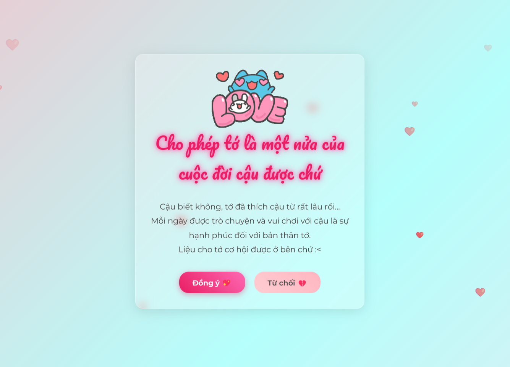

# 💖 Valentine Dành Cho Crush 💖

> ⚠ **LƯU Ý:**  
> 🛠 **Dự án này được xây dựng với sự hỗ trợ của ChatGPT**  
> 👨‍💻 **Tác giả:** Nguyễn Hữu Bách (KimiZK)

🌸 Một trang web nhỏ đáng yêu giúp bạn tỏ tình với crush của mình! Trang web có hiệu ứng đẹp, hoạt ảnh sinh động và đặc biệt là **nút "Từ chối" sẽ di chuyển khi hover vào** 🎀

## 🚀 **Tính Năng**

✅ **Giao diện đẹp, hiệu ứng mượt mà**  
✅ **Nút "Từ chối" di chuyển tránh bị bấm**  
✅ **Hiệu ứng tim bay nền**  
✅ **Thông báo đáng yêu khi được chấp nhận hoặc từ chối**

## 📸 **Hình Ảnh Demo**



## 📥 **Cách Cài Đặt & Chạy**

### 👉 **Cách chạy trên máy tính cá nhân**

1. **Tải xuống hoặc clone repository:**
    ```sh
    git clone https://github.com/KimiZK-Dev/valentine-crush.git
    cd valentine-crush
    ```
2. **Mở `index.html` bằng trình duyệt**

### 👉 **Chạy trên GitHub Pages**

1. **Đẩy code lên GitHub**
2. **Vào phần Settings > Pages**
3. **Chọn nhánh `main` và lưu lại**
4. **Truy cập đường dẫn:**
    ```
    https://[USERNAME GIT CỦA BẠN].github.io/valentine-crush/
    ```

## 🔧 **Công Nghệ Sử Dụng**

-   **HTML**
-   **CSS (Hiệu ứng, Animation, Responsive)**
-   **JavaScript (Xử lý sự kiện, hiệu ứng động)**

## 📞 **Liên Hệ**

📧 **Email:** [Nhấn vào đây](mailto:nguyenhuubach348@gmail.com)  
🌍 **Profile Page:** [Nhấn vào đây](https://kimizk-dev.github.io/My-Profile/)  
🐦 **Facebook:** [Nhấn vào đây](https://facebook.com/KimiZK.Oioioi)

---

✨ **Hy vọng bạn sẽ thành công với màn tỏ tình của mình! Chúc bạn có một mùa Valentine ngọt ngào!** 💖

---

📌 _Lưu ý: Mọi code trong repo này được viết bởi ChatGPT theo yêu cầu của KimiZK_ 😊
